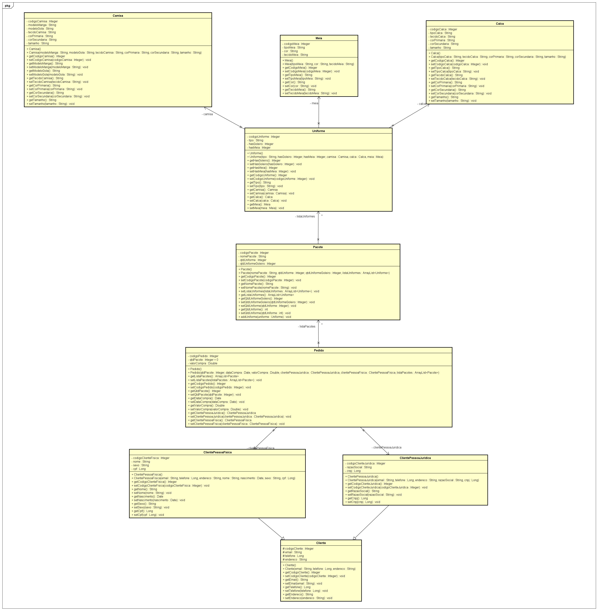

# UNIFTEC - Programação Orientada a Objetos - Simulador de Uniformes (2020/1)
 

# Sobre o projeto

Simulador de Uniformes é uma aplicação JAVA desenvolvida de acordo com as solicitações da disciplina de POO, do Centro Universitário UNIFTEC. O Sistema tem como objetivo receber os dados informados pelo usuário e realizar sua devida distribuição através de objetos.

Ele reproduz uma compra de uniformes, onde o cliente pode montar o mesmo de acordo com a sua necessidade, escolhendo o tipo de uniforme, quantidade, cores e tamanhos.

## Modelo conceitual

# Tecnologias utilizadas
## Back end
- Java

# Autores

Amanda Maschio

 

 

William da Silva

 

 

Reginara Ferreira Borges

 

 

# Professor

Daniel da Silva Cotrim

 
